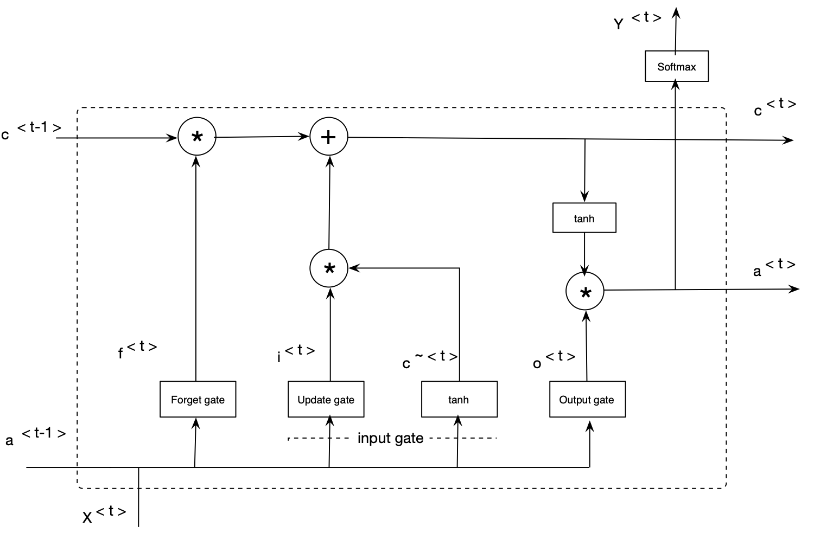
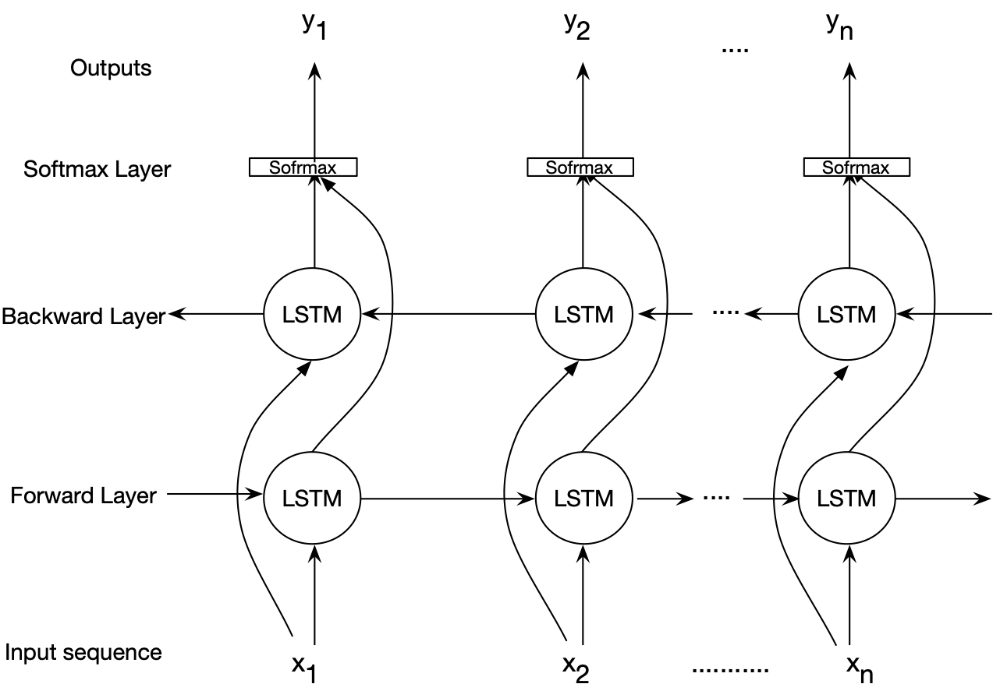
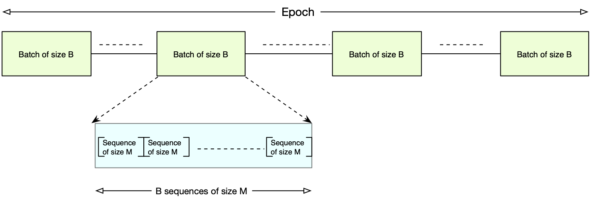
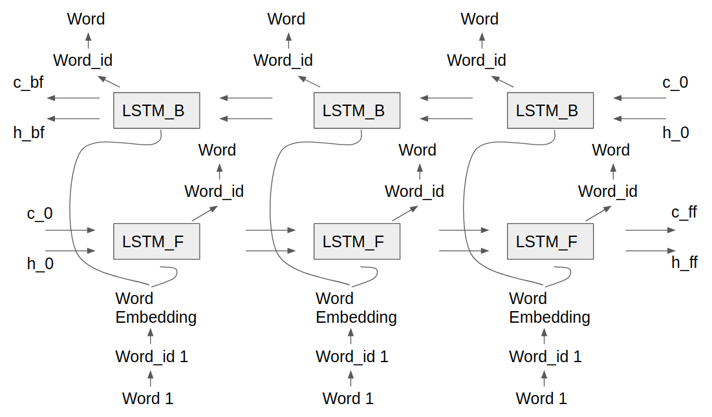

# Modeling-and-Clustering-Genome-using-Bidirectional-LSTM-and-Forward-Backward-LSTM

[Project website](https://nedatavakoli.github.io/Modeling-and-Clustering-Genome-using-Bidirectional-LSTM/)

|        Name      |        Contribution         | 
|------------------|-----------------------------|
| Neda Tavakoli    |    Model 1 and Training     |
| Lane Dalan       |    Model 2                  |
| Richa Tibrewal   |    Clustering               |
| Arthita Ghosh    |    Train Model 2            |
| Harish Kupo KPS  |    Train on English Text    |


In this project, two Deep-Learning based models are presented to model genome data set: Bidirectioanl LSTM and Forward Backward LSTM. For both models the LSTM predictive model was trained on one of two data sets, DNA sequence or natural english test. Once the model was trained query sequences were fed into the model and the vectorization of the LSTM layer was taken as an embedding vector for that query sequence. The embedding vectors of several queries were then run through various clustering algorithms to group sequences found in similar contexts. Clustering DNA sequences in this way can provide insight into what sequences play similar roles or can be found in similar contexts. The natural text modeling and clustering was done primarily to demonstrate the models validity on humnan interpretable content. The advantage of creating a sequence vectorization is that once the (admittedly high) upfront cost of training the LSTM is paid any number of vectorizations can be created very quickly. If you have any questions feel free to contact us, our emails are listed at the end of this document.

##  Model 1: Bidirectional LSTM to model human genome:
The LSTM-based learning networks are an extension for RNNs. These models are capable of addressing the vanishing gradient problem in a very clean manner (i.e., RNN's difficulties in learning long-term dependencies). LSTM networks extend the RNNs memory and enable them to learn long-term dependencies. They can remember information over a long period of time and can read, write, and delete information from theirs memories. The LSTM memory is called a **gated cell**, in which a gate refers to its ability to make the decision of preserving or ignoring the memory. The follwoing picture shows structure one LSTM cell.




Deep bidirectional LSTMs are an extended version of basic LSTMs where the trained model is obtained by applying LSTM twice. Once, the input sequences are fed as-is into the LSTM model (forward layer), a reversed version of the input sequences (i.e., Watson-Crick complement) will be also fed into the LSTM model (backward layer). Using bidirectional LSTMs can improve the performance of the model as the forward and backward pass are considered when making a prediction. This work uses bidirectional LSTMs to model genome data. The following figure illustrates an architecture for the bidirectional LSTM model employed in this project.



The feasibility of the proposed BiLSTM-based model is demonstrated through a case study in which sequences of one chromosome are modeled. We developed several Python scripts to implement and assess the modeling aspect of the proposed BiLSTM-based genome modeling algorithm. We evaluated the model using the human genome as the reference sequence and a set of short reads generated using Illumina sequencing technology as the query sequences. 


We ran the experiments for the following configurations. At each configuration, we model a reference genome and a list of query sequences. Two types of outputs are reported: vector representations (after training the model using the BiLSTM), and perplexity of each epoch of training. (Note: the code for the BiLSTM model is private and might be given upon request).

The following picture shows batches and Epoch inside the reference genome.


### Configuration 1:
	len data:  158970136 characters  (data/Ref Genome]-MT-human2.fa)
	word length =  2
        batch_size=100
	hidden_size=1000
	initial_learning rate=0.001
	num_epochs=100
	num_layers=1
	sequence size=24

	Input dataset:
		Ref genome: data/Ref/MT-human_clean2.fa
		List of query sequences: data/Query/MT-human_clean24.fa
	Outputs:
		1) Vector representations
			Ref genome: Output/ MT-human_clean2_genome_embeddings_sigmoid.csv
			List of query sequences: data/Query/MT-human_clean24_genome_embeddings_sigmoid.csv

		2)Perplexity: 
			Ref genome: Output/Ref/Perplexity for 2, 4, 6
			List of query sequences:  Output/Query/Perplexity for 24, 48, 72
			

### Configuration 2:
	len data:  158970136 characters  (data/MT-human4.fa)
	word length = 4
        batch_size=100
	hidden_size=1000
	initial_learning rate=0.001
	num_epochs=100
	num_layers=1
	sequence size=48

	Input dataset:
		Ref genome: data/Ref/MT-human_clean6.fa
		List of query sequences:  data/Query/MT-human_clean48.fa
	Outputs:
		1) Vector representations
			Ref genome:  Output/Ref/ MT-human_clean4_genome_embeddings_sigmoid.csv
			List of query sequences:  data/Query/MT-human_clean48_genome_embeddings_sigmoid.csv
		2)Perplexity: 
			Ref genome: Output/Ref/Perplexity for 2, 4, 6
			List of query sequences:  Output/Query/Perplexity for 24, 48, 72

			

### Configuration 3:
	len data:  158970136 characters  (data/Ref Genome]-MT-human6.fa)
	word length =  6
        batch_size=100
	hidden_size=1000
	initial_learning rate=0.001
	num_epochs=100
	num_layers=1
	sequence size=72

	Input dataset:
		Ref genome: data/Ref/MT-human_clean6.fa
		List of query sequences: data/Query/MT-human_clean72.fa
	Outputs:
		1) Vector representations
			Ref genome:  Output/ MT-human_clean6_genome_embeddings.csv
			List of query sequences: data/Query/MT-human_clean72_genome_embeddings_sigmoid.csv
		2)Perplexity: 
			Ref genome: Output/Ref/Perplexity for 2, 4, 6
			List of query sequences:  Output/Query/Perplexity for 24, 48, 72
			
			
### Clustering Results:
 Model 1: Bidirectional LSTM 

| Word size | KMeans | DBScan |   GMM | Number of clusters |
|-----------|--------|--------|-------|--------------------|
|         4 |  0.932 |  0.935 | 0.935 |                  5 |
|         2 |  0.184 |  0.186 | 0.186 |                  4 |
|         6 |  0.704 |  0.704 | 0.709 |                  2 |

##  Model 2:  Modeling and Clustering Genome using Foward Backward LSTM
A 2nd LSTM model was developed as the 1st model had restricted use because of its research nature and was not available for all members of the group to use.  Model 2 added the functionality of a Forward Backward LSTM, where one LSTM progressed forwards through the training data while the other progressed backwards.  Separating the forward and backward passes of the LSTM into seperate predictions forces each model to only concentrate on predicting in a single direction.  This architecture examines and vectorizes the input sequence both forwards and backwards while mitigating a suspected training issue with the bidirectional architecture.  The Forward Backward model uses the same LSTM cell and epoch scheme as Model 1, only differing on how predictions and loss are created.  Here is a picture of Forward Backward LSTM architecture.



This model was trained on the fasta representation for Chromosome 12 dataset for two configurations on Google Colab, the details of which are given as follows:

### Configuration 1
1) Embedding size = 100
2) Number of hidden layers = 2
2) Size (No. of neurons) of hidden layer= 100
3) Number of steps = 35
4) Dictionary comprises 4-character words
5) Batch-size = 20
6) No. of epochs = 200


### Configuration 2 
1) Embedding size = 100
2) Number of hidden layers = 2
2) Size (No. of neurons) of hidden layer= 100
3) Number of steps = 35
4) Dictionary comprises 1-character words
5) Batch-size = 20
6) No. of epochs = 200

With other configurations remaining the same, we tried using these trained models to find vector representations for our query sequences. Once we found those representations, we proceeced to cluster them using the aforementioned clustering algorithms. However, the number of clusters formed was around 50 with a high silhoutte score. This made sense because bidirectional LSTMs exploit both the right and left context of a sequence to learn or understand patterns, unlike forward or backward LSTMs which can only use past information (left context). Since repeating sequences in a genome are heavily influenced by what they are surrounded with, both on the left and right, employing a bi-directional LSTM to understand and vectorize sequences is a much better option than using normal LSTMs. 


## Modeling on English text or Why use LSTMs to model?

To better understand how the vector representations are able to cluster the similar query sequences, consider the following english text:
```
The horse runs very fast
The cheetah runs even faster
The pie is tasty
Sweet doughnuts are tasty!
```

Each of the above sentences describe the characteristics of the subject, namely horse and cheetah are fast and that pie and doughnuts are tasty. From the text we can uderstand that the horse and cheetah are similar in the sense that they move quickly. LSTMs do an excellent job at capturing sequential relationships and thus can predict next entity in a given sequence. As the vector representations are generated from a model built using LSTMs, the vectors contain the relationship information and can thus be used to cluster the sequences. To see how it works, a set of such text is generated and then the vector representations are clustered. A colab version of the code is available [here](https://colab.research.google.com/drive/1J2PKCcGaMQkahcxtbPvU8GH2Lx6yqDVS). In short, the following code generates the input text
```python
colors = ("blue", "green", "red", "cyan", "magenta", "yellow", "black", "white")
animals = ("cats", "dogs", "horses", "tigers", "lions", "monkeys", "pigs", "hyenas", "donkeys")
temperature = ("hot", "cold")
food = ("apple", "cider", "mint", "meat", "lasagna", "orange", "chocolate", "cream", "milk", "banana")

# for each color (c) and animal (a) pair produce the following string
"the {} {} run very fast".format(c, a)

# Similarly for each temperature (t) and food (f) pair produce the following string
"I like to eat {} {} pies".format(t, f)
```

The generated strings are trained using a Bidirectional LSTM with the following configuration:

1) Number of hidden layers = 2
2) Size (No. of neurons) of hidden layer = 1024
3) Number of steps = 6
4) Dictionary contains the unique words in the sentence
5) Batch-size = 20
6) No. of epochs = 20

The LSTM trains very quickly because of the small vocab size and repetitive data. Once the model is built, query sequences are vectorized using the model and then clustered. The following code generates the query sequences:

```python
# for each color (c) and animal (a) pair, emit
"{} {}".format(c, a)

# Similarly for each temperature (t) and food (f) pair, emit
"{} {}".format(t, f)
```

### Clustering the vector representations
The code for clustering is available as a colab project [here](https://colab.research.google.com/drive/1nzH6MhNG-giojtmR3_8Z8V75DFRYK2rA). The clustering code runs 3 different clustering algorithms and as expected, all of the algorithms cluster the query sequences into two clusters.

| Kmeans               | GMM                  | DBSCAN               |
|----------------------|----------------------|----------------------|
| Score, # of Clusters | Score, # of Clusters | Score, # of Clusters |
| 0.982, 2             | 0.986, 2             | 0.986, 2             |


## Note:  If you have any questions feel free to contact us:
	Neda Tavakoli, email: tavakoli.neda@gmail.com 
	Lane Dalan, email: lddalan@gmail.com
	Richa Tibrewal, email: richa.tibrewal@gatech.edu
	Arthita Ghosh, email: aghosh80@gatech.edu
	Harish Kupo KPS, email: harishkrupo@gmail.com
